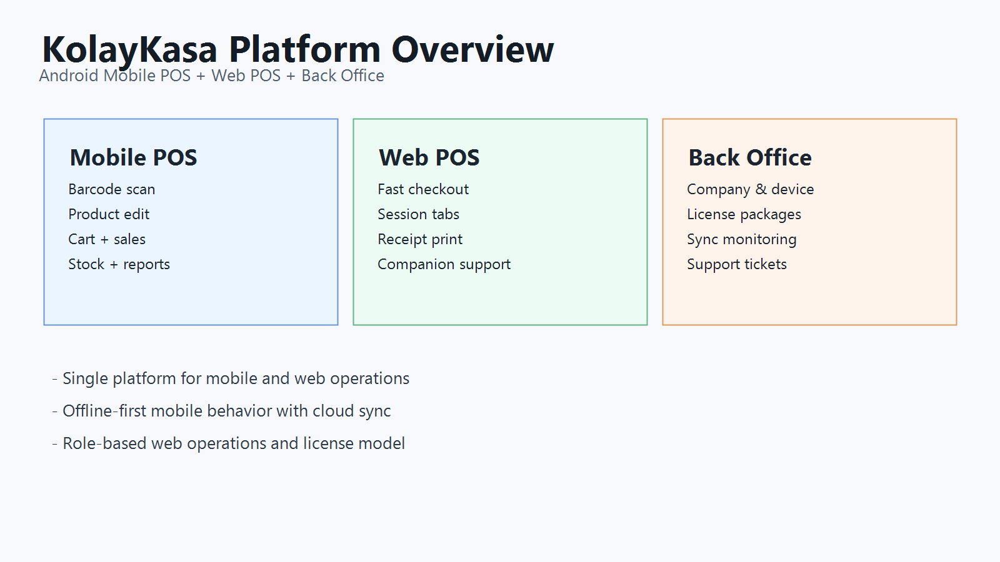
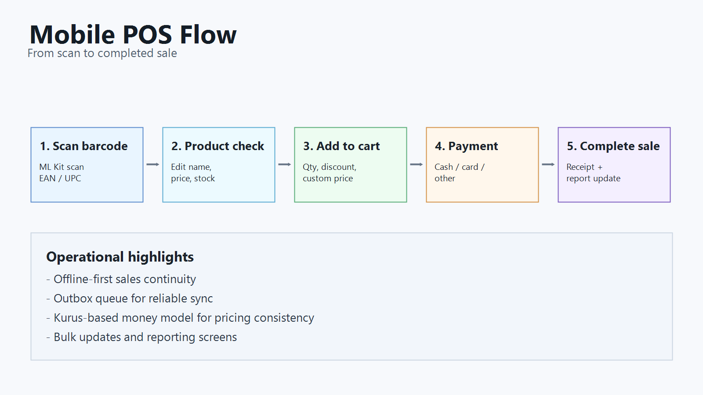
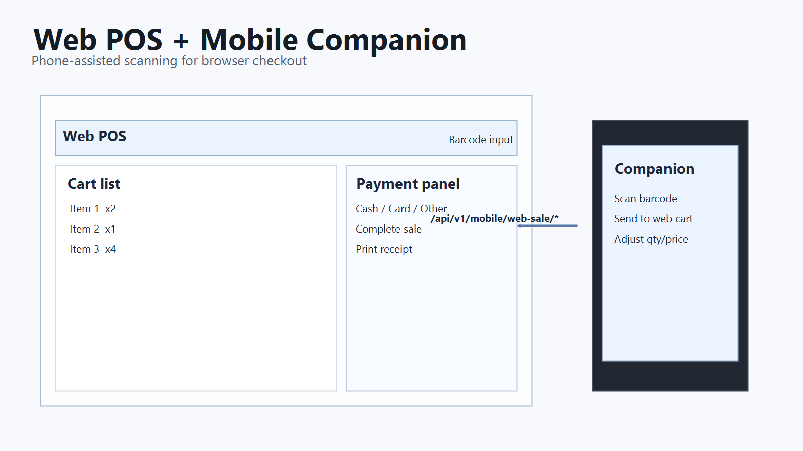
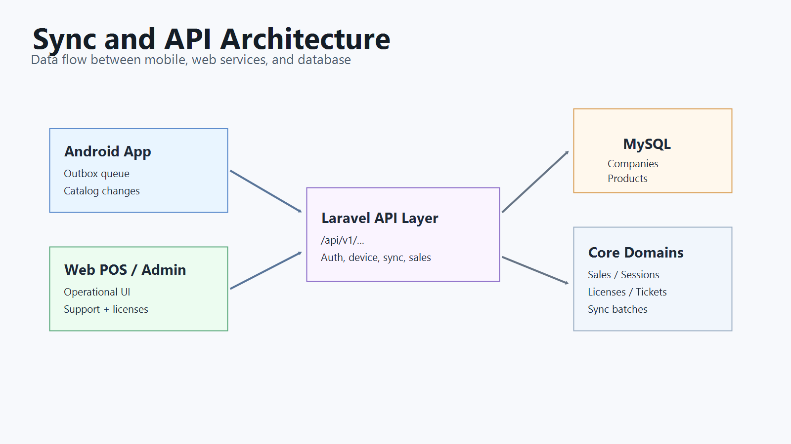

# KolayKasa (MarketPOS)

KolayKasa, barkod tabanli satis sureclerini mobil (Android) ve web (Laravel) kanallarinda tek platformda yoneten bir POS ekosistemidir.

## Project Description
Bu proje su 3 ana ihtiyaci cozer:
- Mobilde internet olmasa bile satisa devam etmek (offline-first)
- Web tarafinda firma, cihaz, lisans, satis ve destek operasyonlarini merkezden yonetmek
- Mobil ve web kanallarini API + senkron mekanizmasi ile tek veri modelinde birlestirmek

Hedef kitle:
- Market, tekel, bufe ve benzeri kucuk/orta olcekli isletmeler

## Features
- Android mobil POS (barkod okuma, urun yonetimi, satis, stok, rapor)
- Web POS (`/pos`) ve companion mod (telefonu web kasaya barkod okuyucu gibi baglama)
- Back Office admin paneli (firma/cihaz/lisans/senkron/ticket yonetimi)
- Lisans ve paket modeli (FREE / SILVER / GOLD)
- Ticket/destek sistemi (mobil + web POS + admin)
- Fis goruntuleme/yazdirma akisleri

Detayli ozellik listesi:
- [`dokumanlar/gelistirici-dokumanlari/ozellikler.md`](dokumanlar/gelistirici-dokumanlari/ozellikler.md)
- [`dokumanlar/uygulama-dokumanlari/program özellikleri.md`](dokumanlar/uygulama-dokumanlari/program%20%C3%B6zellikleri.md)

## Tech Stack
Android:
- Kotlin, Jetpack Compose, MVVM
- Hilt, Room, Coroutines/Flow, WorkManager
- CameraX, ML Kit (Barcode + OCR)

Web:
- PHP 8.2+, Laravel 12, Filament 5
- Blade, Vite, Tailwind, MySQL

Genel:
- REST API (`/api/v1/...`)
- Token tabanli kimlik dogrulama
- Dedup + outbox senkron mimarisi

## Installation Guide
### Gereksinimler
- Android Studio (JDK 17), Android SDK 35
- PHP 8.3+, Composer 2.x
- Node.js 20+ ve npm
- MySQL 8+

### Android
Linux/macOS:
```bash
./gradlew :app:assembleDebug
```
Windows:
```powershell
.\gradlew.bat :app:assembleDebug
```

### Web
```bash
cd web-application
composer install
cp .env.example .env
php artisan key:generate
php artisan migrate
npm install
npm run build
php artisan serve
```

Windows PowerShell'de `.env` olusturma:
```powershell
Copy-Item .env.example .env
```

Detayli kurulum rehberi:
- [`dokumanlar/gelistirici-dokumanlari/kurulum-rehberi.md`](dokumanlar/gelistirici-dokumanlari/kurulum-rehberi.md)

## Project Structure
```text
.
|-- market-pos-app/                     # Android uygulamasi
|-- web-application/                    # Laravel web uygulamasi
|-- dokumanlar/
|   |-- gelistirici-dokumanlari/        # Kurulum, API, mimari, roadmap, ozellikler
|   |-- uygulama-dokumanlari/           # Fazlar, test listeleri, urun notlari
|   `-- web-dokumanlari/                # Web API/veri modeli/deployment notlari
|-- tools/                              # Yardimci script ve araclar
`-- ai_docs/                            # AI destekli proje haritasi ve hafiza
```

## Screenshots
Projeyi anlatmak icin uretilmis ozet ekran gorselleri:

1. Platform genel bakis  


2. Mobil POS akisi  


3. Web POS ve companion iliskisi  


4. Senkron ve API mimarisi  



## API Overview
Base URL:
- `https://barkod.space`

Temel endpoint gruplari:
- Auth: `/api/v1/auth/*`
- Aktivasyon/cihaz: `/api/v1/device/*`
- Katalog/senkron: `/api/v1/sync/*`, `/api/v1/auth/companies/*/catalog*`
- Companion satis: `/api/v1/mobile/web-sale/*`
- Destek: `/api/v1/support/*`

Detayli API dokumani:
- [`dokumanlar/gelistirici-dokumanlari/api-dokumani.md`](dokumanlar/gelistirici-dokumanlari/api-dokumani.md)
- [`dokumanlar/web-dokumanlari/web-api-sozlesmesi.md`](dokumanlar/web-dokumanlari/web-api-sozlesmesi.md)

## Roadmap
Durum (2026-03-08):
- V4 Faz 0-14 tamamlandi
- Acik kalan maddeler stabilizasyon, regresyon testleri ve release hazirligi odakli

Detayli yol haritasi:
- [`dokumanlar/gelistirici-dokumanlari/roadmap.md`](dokumanlar/gelistirici-dokumanlari/roadmap.md)

## Contributing
Katki sureci:
1. Issue ac veya mevcut issue ile calismayi eslestir.
2. Ayrik bir branch olustur (`feature/...` veya `fix/...`).
3. Degisikligi test edip dokumanlari guncelle.
4. Pull request ac ve degisiklik kapsamini net yaz.

Detayli katki rehberi:
- [`CONTRIBUTING.md`](CONTRIBUTING.md)

## License
Bu repoda su an acik bir open-source lisans metni tanimli degildir.
Lisans politikasi netlesene kadar tum haklar repo sahibine aittir.

Detay:
- [`LICENSE.md`](LICENSE.md)
